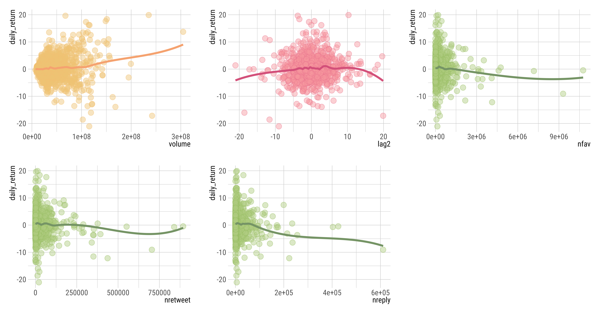

```{r setup, include=FALSE}
knitr::opts_chunk$set(echo = FALSE, out.width = "80%", warning = FALSE, message = FALSE, fig.align = "center", results='hold')
library(kableExtra)
library(knitr)
library(dplyr)
library(ggplot2)
library(ggrepel)
library(hrbrthemes)
library(class)
library(plotly)
library(GGally)
library(MASS)
library(ISLR2)
library(glmnet)
library(boot)
library(splines)
library(tree)
library(randomForest)
library(gam)
library(ggstar)
library(glmnet)
library(lubridate)
library(showtext)
library(e1071)
#extrafont::loadfonts(device="win")
#font_add_google("Roboto Condensed", "Roboto Condensed")
#showtext_auto()
```


<script src="assets/min.js"></script>
<script src="//cdnjs.cloudflare.com/ajax/libs/highlight.js/9.12.0/highlight.min.js"></script>


```{r}
source("data/data.R")
stocks.data <- data.frame(tsla.stock) %>% 
  dplyr::select(-adjusted)
stocks.data$direction <- as.factor(stocks.data$direction)

twitter.data <- read.csv("data/dfclean.csv") %>% 
  dplyr::select(created_at, status_id, text, favorite_count, 
                retweet_count, quote_count, reply_count)
twitter.data$created_at <- as_datetime(twitter.data$created_at)
twitter.data$created_at <- as.Date.character(twitter.data$created_at)

twitter.data <- twitter.data %>% dplyr::group_by(created_at) %>% 
  summarise(ntweets = n(),
            nfav = sum(favorite_count),
            nretweet = sum(retweet_count),
            nreply = sum(reply_count),
            alltext = paste0(text, collapse = " ")) %>% 
  arrange(desc(created_at))

df <- dplyr::inner_join(twitter.data, stocks.data, by = c("created_at" = "date"))
```


### Data Description


> Stock Market Data for `Tesla` between $2016$ and $2022$


The dataset we use for the following statistical analysis is stock market data for Elon Musk's publicly traded companies `Tesla` and `Twitter` from $01/01/2018$ to $05/20/2022$. We obtained this data from the Yahoo Finance API using the package `quantmod` in R. The data contains the daily percentage returns for the Tesla and Twitter stock indexes, with $2208$ observations on the following $13$ variables.


```{r}
df.preview <- data.frame("Variable" = c("symbol", "date", "open", "close", "high", "low", "volume", "direction", "return", "lag1", "lag2", "lag3", "lag4"), 
                         "Type" = c("character", "datetime", "float", "float", "float", "float", "integer", "factor", "decimal", "decimal", "decimal", "decimal", "decimal"), 
                         "Description" = c("The ticker symbol uniquely indefintying a stock", "The trade day of the recorderd observation", "Opening value of the stock that day", "Closing value of the stock that day", "Highest price of the stock on a given trade day", "Lowest price of the stock on a given trade day", "Number of daily shares traded in billions", "Factor indicating whether the market had a positive or negative return", "Percentage return for that day", "Percentage return for previous day", "Percentage return for 2 days previous", "Percentage return for 3 days previous", "Percentage return for 4 days previous"))


kbll1 <- kable(df.preview, col.names = c("variable", "type", "description")) %>% 
  kable_styling(full_width = F, bootstrap_options = c("striped", "hover"), html_font = "Roboto") %>%
  column_spec(1, extra_css = c("text-transform: uppercase; letter-spacing: 1.25px; font-weight: 500; font-size: 8pt;")) %>%
  column_spec(2:3, extra_css = c("font-weight: 300; font-size: 8.5pt; letter-spacing: 0.4px; opacity: 0.85;")) %>%
  row_spec(0, extra_css = c("text-transform: uppercase; letter-spacing: 1.25px; font-weight: 400; font-size: 8pt; border-bottom: 1px solid #ddd; opacity: 0.35;")) %>%
  column_spec(1:3, extra_css = c("border-bottom: 1px solid #FEFEFE; color: #111111 !important;"))

kbll1
```


> Twitter Data for `Elon Musk` between $2016$ and $2022$


Dataset of Elon Musk’s most recent Tweets during 2015-2022, stored in CSV format, where each row represents a separate tweet object. All Tweets are collected, parsed, and plotted using the Twitter API and rtweet package in R. In total, there are more than ten-thousand tweets in this dataset, including retweets, replies, and quotes. All objects are to go into a single database.


```{r}

```


<div class = "roundedlist2">


a. Make some pairwise scatterplots of the predictors (columns) in this data set.


Here, we use the `pairs` function to create a scatterplot matrix for every pair of variables in the stock dataset as shown below.


```{r, echo=TRUE, eval=FALSE}
df.pairs <- df %>% dplyr::select(-alltext)
pairs(stocks.data)
```


```{r, out.width="100%"}
df.pairs <- df %>%
  mutate(direction = as.numeric(direction)) %>%
  dplyr::select(-direction) %>%
  dplyr::select(-alltext, -name, -close)
# showtext::showtext.auto()


myData <- data.frame(na.omit(df.pairs))
```


```{r}
my_scatter <- function(data, mapping, ...) {
  ggplot(data = data, mapping = mapping) +
    geom_point(alpha = 0.25,  shape = 16, size=0.2) +
    geom_smooth(method = "loess", size = 0.4, alpha=1, se = FALSE)} 
```

```{r, out.width="100%"}
p <- ggpairs(df.pairs, upper = list(continuous = wrap("cor", size = 1)),
             diag = list(continuous = wrap("densityDiag", cex = 0.25)), 
             lower = list(continuous = my_scatter)) + 
  theme_minimal(base_family = "Roboto Condensed", base_size = 8) + 
  theme(text = element_text(size = 8, face = "bold"), 
        axis.text = element_text(size = 5, face = "plain"), 
        panel.grid = element_line(size = 0.1),
        axis.text.x = element_text(size = 5), axis.text.y = element_text(size = 5))


ragg::agg_png(filename = "static/ppairs1.png", width = 7087, height = 6595, units = "px", res = 900)
p
invisible(dev.off())
knitr::include_graphics("static/ppairs1.png")

```


Based on the correlation coefficients and their corresponding p-values, there is indeed an association between the `daily return rate` and the predictors `volume`, `lag2`, `nfav`, `nretweet`, and `nreply`.


```{r, out.width="100%", fig.show='hold', fig.align='default'}
pairs.plot1 <- ggplot(data = df.pairs, mapping = aes(x = volume, y = daily_return)) + geom_point(shape = 21, fill = "#EDC373", color = "#F1BF70", alpha = 0.45, size = 2.5, stroke=0.4) + geom_smooth(cex = 1, alpha=0.15, color = "#F5A26F", se = FALSE, method = "loess", span = 0.25) + xlab("volume") + ylab("daily_return") + theme_ipsum_rc(plot_margin = ggplot2::margin(10, 10, 10, 10), base_size = 8) + theme(axis.title.y = element_text(size = 8), axis.text.y = element_text(size = 8), axis.text.x = element_text(size = 8), axis.title.x = element_text(size = 8))

pairs.plot2 <- ggplot(data = df.pairs, mapping = aes(x = lag2, y = daily_return)) + geom_point(shape = 21, fill = "#F7969E", color = "#E9738D", alpha = 0.45, size = 2.5, stroke=0.4) + geom_smooth(cex = 1, alpha=0.15, color = "#D3507A", se = FALSE, method = "loess", span = 0.25) + xlab("lag2") + ylab("daily_return") + theme_ipsum_rc(plot_margin = ggplot2::margin(10, 10, 10, 10), base_size = 8) + theme(axis.title.y = element_text(size = 8), axis.text.y = element_text(size = 8), axis.text.x = element_text(size = 8), axis.title.x = element_text(size = 8))

pairs.plot3 <- ggplot(data = df.pairs, mapping = aes(x = nfav, y = daily_return)) + geom_point(shape = 21, fill = "#AFCB80", color = "#97BC62", alpha = 0.45, size = 2.5, stroke=0.4) + geom_smooth(cex = 1, alpha=0.15, color = "#759465", se = FALSE, method = "loess", span = 0.25) + xlab("nfav") + ylab("daily_return") + theme_ipsum_rc(plot_margin = ggplot2::margin(10, 10, 10, 10), base_size = 8) + theme(axis.title.y = element_text(size = 8), axis.text.y = element_text(size = 8), axis.text.x = element_text(size = 8), axis.title.x = element_text(size = 8))

pairs.plot4 <- ggplot(data = df.pairs, mapping = aes(x = nretweet, y = daily_return)) + geom_point(shape = 21, fill = "#AFCB80", color = "#97BC62", alpha = 0.45, size = 2.5, stroke=0.4) + geom_smooth(cex = 1, alpha=0.15, color = "#759465", se = FALSE, method = "loess", span = 0.25) + xlab("nretweet") + ylab("daily_return") + theme_ipsum_rc(plot_margin = ggplot2::margin(10, 10, 10, 10), base_size = 8) + theme(axis.title.y = element_text(size = 8), axis.text.y = element_text(size = 8), axis.text.x = element_text(size = 8), axis.title.x = element_text(size = 8))

pairs.plot5 <- ggplot(data = df.pairs, mapping = aes(x = nreply, y = daily_return)) + geom_point(shape = 21, fill = "#AFCB80", color = "#97BC62", alpha = 0.45, size = 2.5, stroke=0.4) + geom_smooth(cex = 1, alpha=0.15, color = "#759465", se = FALSE, method = "loess", span = 0.25) + xlab("nreply") + ylab("daily_return") + theme_ipsum_rc(base_size = 8, plot_margin = ggplot2::margin(10, 10, 10, 10)) + theme(axis.title.y = element_text(size = 8), axis.text.y = element_text(size = 8), axis.text.x = element_text(size = 8), axis.title.x = element_text(size = 8))

ggarr1 <- ggpubr::ggarrange(pairs.plot1, pairs.plot2, pairs.plot3, pairs.plot4, pairs.plot5, ncol = 3, nrow = 2)


ragg::agg_png(filename = "static/ggarr1.png", width = 7887, height = 4095, units = "px", res = 900)
ggarr1
invisible(dev.off())

```


d. Do any of the stocks appear to have particularly high closing values, daily return rates, or volume of traded shares?


Here, let's visualize the distribution for the closing value, daily return rate, and volume by plotting a histogram for each variable as follows.


```{r, out.width="32%", fig.show='hold', fig.align='default'}

ggplot(data = df.pairs, mapping = aes(x = high)) + geom_histogram(color = "#97BC62", fill = "#C6E67A", cex=0.35) + 
  xlab("Closing Value") + ylab("Number of Suburbs") + theme_ipsum_rc(base_size = 10) + theme(axis.title.y = element_text(size = 10), axis.text.y = element_text(size = 10), axis.text.x = element_text(size = 10), axis.title.x = element_text(size = 10))

ggplot(data = df.pairs, mapping = aes(x = daily_return)) + geom_histogram(color = "#97BC62", fill = "#C6E67A", cex=0.35) + theme_ipsum_rc(base_size = 10) + theme(axis.title.y = element_text(size = 10), axis.text.y = element_text(size = 10), axis.text.x = element_text(size = 10), axis.title.x = element_text(size = 10))

ggplot(data = df.pairs, mapping = aes(x = volume)) + geom_histogram(color = "#97BC62", fill = "#C6E67A", cex=0.35) + theme_ipsum_rc(base_size = 10) + theme(axis.title.y = element_text(size = 10), axis.text.y = element_text(size = 10), axis.text.x = element_text(size = 10), axis.title.x = element_text(size = 10))


```


Now, let's take a closer look at the `crim` variable, per capita crime rate by town. 


```{r, echo=TRUE}
range(df.pairs$high)
summary(df.pairs$high)

```


The range of the crime rates predictor is from $0.00632$ to $88.97620$. The median and maximum crime rate values are respectively $0.26\%$ and $89\%$; hence, there are indeed some suburbs of Boston where the crime rate is particularly high.


</div>


------------------------------------


### Model Fitting


> 3. In this problem, we analyze a (real, not simulated) dataset of with a quantitative response $Y$ , and $p \geq 50$ quantitative predictors.


<div class = "roundedlist2">


a. Fit a least squares linear model to the data, and provide an estimate of the test error. 

First, we must ensure that the missing values are removed from the data.


```{r,echo=TRUE}
#myData <- na.omit(df.pairs)
x <- model.matrix(daily_return ~ ., data = myData)[, -1]
y <- myData$daily_return
```

Now, we fit a least squares linear model to the data.


```{r, echo=TRUE}
lm.model <- lm(daily_return ~ ., data = myData)
```


Next, we split the data into a training set and a test set in order to provide an estimate of the test error.


```{r, echo=TRUE}
set.seed(400)
train <- sample(1:nrow(x), nrow(x) / 2)
test <- (-train)
y.test <- y[test]

lm.pred <- predict(lm.model, newx = x[test, ])
mean((lm.pred - y.test)^2)
```


The estimate of the test error is $267736.8$.


c. Fit a ridge regression model to the data, with a range of values of the tuning parameter $\lambda$. Make a plot like the left-hand panel of Figure 6.4 in the textbook.

We will perform a ridge regression in order to predict Salary on the Hitters data. We first fit a ridge regression model.


```{r, echo=TRUE}
grid <- 10^seq(10, -2, length = 100)
ridge.mod <- glmnet(x, y, alpha = 0, lambda = grid)
```

We've chosen to implement the function over a grid of values ranging from $\lambda = 10^{10}$ to $\lambda = 10^{-2}$. Associated with each value of $\lambda$ is a vector of ridge regression coefficients, stored in a $20 \times 100$ matrix.


d. What value of $\lambda$ in the ridge regression model provides the smallest estimated test error? 


We split the samples into a training and test set in order to estimate the test error of ridge regression. We first set a random seed so that the results obtained will be reproducible. 
```{r, echo=TRUE}
set.seed(500)
train <- sample(1:nrow(x), nrow(x) / 2)
test <- (-train)
y.test <- y[test]
```


Next, we fit a ridge regression model on the training set. 

```{r, echo=TRUE}
ridge.mod <- glmnet(x[train, ], y[train], alpha = 0, lambda = grid, thresh = 1e-12)
```


Now we want to evaluate its MSE on the test set using some $\lambda$. We use cross-validation to choose the tuning parameter $\lambda$ rather than arbitrarily choosing $\lambda$. We do this using the built-in cross-validation function `cv.glmnet()` as follows.


```{r, echo=TRUE}
set.seed(500)
cv.out <- cv.glmnet(x[train, ], y[train], alpha = 0)
plot(cv.out)
bestlam <- cv.out$lambda.min
bestlam
```


Therefore, we see that the value of $\lambda$ that results in the smallest cross-validation error is $326$. Now, we compute the test MSE associated with this value of $\lambda$.


```{r, echo=TRUE}
ridge.pred <- predict(ridge.mod, s = bestlam, newx = x[test, ])
mean((ridge.pred - y.test)^2)
```

Hence, the estimate of test error is $105738.2$.

Finally, we refit our ridge regression model on the full data set, using the value of $\lambda$ chosen by cross-validation, and examine the coefficient estimates.


```{r, echo=TRUE}
out <- glmnet(x, y, alpha = 0)

predict(out, type = "coefficients", s = bestlam)[1:12, ]
```


e. Repeat (c), but for a lasso model.


In order to fit a lasso model, we use the `glmnet()` function, but using the argument `alpha = 1` as shown below.

```{r, echo=TRUE}
lasso.mod <- glmnet(x[train, ], y[train], alpha = 1, lambda = grid)
plot(lasso.mod)
```


f. Repeat (d), but for a lasso model. Which features are included in this lasso model?


We now perform cross-validation and compute the associated test error.

```{r, echo=TRUE}
set.seed(600)
cv.out <- cv.glmnet(x[train, ], y[train], alpha = 1)
plot(cv.out)
bestlam <- cv.out$lambda.min
lasso.pred <- predict(lasso.mod, s = bestlam, newx = x[test, ])
mean((lasso.pred - y.test)^2)
```


Hence, the test set MSE of the lasso model is $124491.4$.


</div>


------------------------------------


### Polynomial Regressions and Splines


> 4. For this problem, we use the `Wage` data set that is part of the ISLR package. Split the data into a training set and a test set.

First, we split the `Wage` dataset into a training and test set as follows.

```{r, echo=TRUE}
set.seed(4)
#myData <- data.frame(na.omit(df.pairs))
train <- sample(1:nrow(myData), nrow(myData) / 2)
wage.train <- myData[train, ]
wage.test <- myData[-train, ]
```


<div class = "roundedlist2">

a. Fit a polynomial model to predict `Wage` using `Age` on the training set.


Here, we fit a polynomial model on the training set using the `poly()` function within `lm()`. We begin by producing a fourth-order polynomial fit to predict `wage` using `age` as follows.


```{r, echo=TRUE}
lm.fit4 <- lm(daily_return ~ poly(lag2 , 4), data = myData)
lm.summary <- summary(lm.fit4)
```


```{r, fig.show='hold'}
summary.lmfit <- data.frame(lm.summary$coefficients)
summary.lmfit2 <- data.frame("Residual standard error" = lm.summary$sigma, "Multiple R-squared" = lm.summary$r.squared, "Adjusted R-squared" = lm.summary$adj.r.squared, "F-statistic" = lm.summary$fstatistic[1], "p-value" = pf(lm.summary$fstatistic[1], lm.summary$fstatistic[2], lm.summary$fstatistic[3], lower.tail = FALSE))
summary.lmfit2 <- t(summary.lmfit2)
row.names(summary.lmfit2) <- c("Residual Standard Error", "Multiple R-Squared", "Adjusted R-Squared", "F-Statistic", "P-Value")

kbl1 <- kable(summary.lmfit, col.names = c("Estimate", "Std. Error", "T-Value", "P-Value"))%>% kable_styling(full_width = F, bootstrap_options = c("striped", "hover"), font_size = 10, html_font = "Roboto Condensed")

kbl2 <- kable(summary.lmfit2, row.names = T, col.names = c(" "))%>% kable_styling(full_width = F, bootstrap_options = c("striped", "hover"), font_size = 10, html_font = "Roboto Condensed") %>% column_spec(1, extra_css = c("font-weight: 600;"))

knitr::kables(list(kbl1, kbl2)) %>% kable_styling(full_width = F, bootstrap_options = c("hover"), font_size = 10, html_font = "Roboto Condensed")
```

This suggests that including additional polynomial terms, up to third order, leads to an improvement in the model fit. However, further investigation of the data reveals that no polynomial terms beyond the third order have significant p-values in a regression fit. Next, we use the **validation set approach** and estimate the test error that results from predicting `wage` using polynomial functions of `age` as follows.

```{r, echo=TRUE}
set.seed(4)
test.error <- rep(0, 10)
for (i in 1:10){
  model.fit <- lm(daily_return ~ poly(lag2, i), data = myData, subset = train)
  yhat <- predict(model.fit, newdata = wage.test)
  test.error[i] <- mean((wage.test$daily_return - yhat)^2)
}
```


```{r}
df.vs <- data.frame("Degree" = c("1", "2", "3", "4", "5", "6", "7", "8", "9", "10"), "Test Error" = test.error)
df.vst <- data.frame(t(df.vs), row.names = c("Order", "Test Error"))

kable(df.vst, col.names = NULL, caption = "Validation Set Errors")%>% kable_styling(full_width = F, bootstrap_options = c("striped", "hover"), font_size = 10, html_font = "Roboto Condensed") %>% column_spec(1, extra_css = c("font-weight: 600 !important; text-align: right;"), width_min =   "0.6in") %>% row_spec(1, background = "#CEDEB4", color = "white", extra_css = c("text-align: right;"))  %>% row_spec(2, extra_css = c("text-align: right;"))
```


```{r}
df.cv <- data.frame(mse = test.error, degree = c(1, 2, 3, 4, 5, 6, 7, 8, 9, 10))

p4a <- ggplot(data = df.cv, mapping = aes(x = degree, y = mse)) +
 geom_line(color = "#00A560", cex = 1) + geom_point(color = "#006E52") + theme_ipsum_rc(base_size = 12, axis_title_size = 12) + xlab("Degree of Polynomial") + ylab("Training Set Mean Squared Error") + ggtitle("Validation Set Approach") + theme_ipsum_rc(plot_title_size = 10, axis_text_size = 8)

ragg::agg_png(filename = "static/fig4a.png", width = 7087, height = 3895, units = "px", res = 900)
p4a
invisible(dev.off())

```


We find that the validation set error rates for the models with first, second, third, fourth, and fifth orders are $1709.923$, $1639.436$, $1636.682$, $1635.943$, $1638.892$ respectively. Based on these results, a model that predicts `wage` using a cubic function of `age` performs better than models that involve only a linear or quadratic function, and there is little evidence in favor of a model that uses anything above a fourth-degree function.


Next, we use the **cross-validation approach** for polynomials of order $i = 1$ to $i = 10$ and compute the associated cross-validation error. We also use the `cv.glm()` function to implement a $k$-fold CV. Below, we use $k = 10$ on the Wage data set. 


```{r, echo=TRUE}
set.seed(4)
cv.error.10 <- rep(0, 10)
for (i in 1:10) {
  glm.fit <- glm(daily_return ~ poly(lag2, i), data = myData)
  cv.error.10[i] <- cv.glm(myData, glm.fit, K = 10)$delta[1]
}
```


```{r}
df.vs10 <- data.frame("Degree" = c("1", "2", "3", "4", "5", "6", "7", "8", "9", "10"), "Test Error" = cv.error.10)
df.vst10 <- data.frame(t(df.vs10), row.names = c("Order", "Test Error"))

kable(df.vst10, col.names = NULL, caption = "10-fold Cross-Validation Errors")%>% kable_styling(full_width = F, bootstrap_options = c("striped", "hover"), font_size = 10, html_font = "Roboto Condensed") %>% column_spec(1, extra_css = c("font-weight: 600 !important; text-align: right;"), width_min =   "0.6in") %>% row_spec(1, background = "#CEDEB4", color="white", extra_css = c("text-align: right;"))  %>% row_spec(2, extra_css = c("text-align: right;"))
```


```{r}
df.cv10 <- data.frame(degree = c(1, 2, 3, 4, 5, 6, 7, 8, 9, 10), mse = cv.error.10)

p4ab <- ggplot(data = df.cv10, mapping = aes(x = degree, y = mse)) + geom_line(color = "#00A560", cex = 1) + geom_point(color = "#006E52") + theme_ipsum_rc(base_size = 12, axis_title_size = 12, plot_title_size = 12) + xlab("Degree of Polynomial") + ylab("Mean Squared Error") + ggtitle("10-fold CV")

ragg::agg_png(filename = "static/fig4ab.png", width = 7087, height = 3895, units = "px", res = 900)
p4ab
invisible(dev.off())
knitr::include_graphics("static/fig4ab.png")
```


Similar to our results from the validation set approach, we see a steep drop in the estimated test MSE between the linear, quadratic, and cubic fits, but then no clear improvement from using higher-order polynomials. Hence, we see little evidence that using a fifth or higher-order polynomial terms leads to lower test error than simply using a cubic or quartic fit. 

Based on our overall results, we see that a polynomial of order three results in the lowest test error. In the following, we fit a polynomial model at the third-order to predict `wage` using `age` on the training set, calculate the test error, and then plot the fit and observations.


```{r, echo=TRUE}
glm.fit3 <- glm(daily_return ~ poly(lag2 , 3), data = myData, subset = train)
glm.preds <- predict(glm.fit3, newdata = wage.test)
mean((wage.test$daily_return - glm.preds)^2)
```

We get the test error $1636.682$ using a polynomial at the third-order.


```{r, out.width="85%"}
p4ac <- ggplot() + geom_point(data = myData, mapping = aes(y = daily_return, x = lag2), color = "#A4A6A8", alpha = 0.5, cex = 0.85) + geom_line(mapping = aes(x = wage.test$lag2, y = glm.preds), color = "#AFD396", cex = 1.3, alpha = 1, se = F) + theme_ipsum_rc(base_size = 12, axis_title_size = 12, plot_title_size = 12) + ggtitle("Polynomial: Third-Order")

ragg::agg_png(filename = "static/fig4ac.png", width = 7087, height = 4295, units = "px", res = 900)
p4ac
invisible(dev.off())


```


b. Fit a step function model.

Here, we fit a step function model to predict `Wage` using `Age` on the training set. In order to fit a step function, we use the `cut()` function as follows.


```{r, echo=TRUE}
set.seed(4)
stepfunc.error <- rep(NA, 10)
for (i in 2:10) {
  myData$lag2.cut <- cut(myData$lag2, i)
  stepfunc.fit <- glm(daily_return ~ lag2.cut, data = myData)
  stepfunc.error[i] <- cv.glm(myData, stepfunc.fit)$delta[1]
}
err.min <- which.min(stepfunc.error)
```


In the above command, the `err.min` gives us the number of cuts yielding the smallest error. In the following, we display our step function error estimates and plot the error estimates for different degrees of the polynomial.


```{r}
deg.min <- which.min(stepfunc.error)

df.steperr <- data.frame("Degree" = c("1", "2", "3", "4", "5", "6", "7", "8", "9", "10"), "Test Error" = stepfunc.error)
df.steperr <- data.frame(t(df.steperr), row.names = c("Order", "Test Error"))

kable(df.steperr, col.names = NULL, caption = "stepfunc.error")%>% kable_styling(full_width = F, bootstrap_options = c("striped", "hover"), font_size = 10, html_font = "Roboto Condensed") %>% column_spec(1, extra_css = c("font-weight: 600 !important; text-align: right;"), width_min =   "0.6in") %>% row_spec(1, background = "#CEDEB4", extra_css = c("text-align: right;"))  %>% row_spec(2, extra_css = c("text-align: right;"))
```


```{r, message=FALSE, warning=FALSE}
stepfunc.df <- data.frame(degree = c(1, 2, 3, 4, 5, 6, 7, 8, 9, 10), error = stepfunc.error)

p4b <- ggplot(data = stepfunc.df, mapping = aes(x = degree, y = error)) + xlab("Cuts") + ylab("Test MSE") + geom_line(color = "#00A560", cex = 1) + geom_point(color = "#006E52", alpha = 0.95) + theme_ipsum_rc(base_size = 12, axis_title_size = 12, plot_title_size = 12) + ggtitle("Step Function") + geom_star(mapping = aes(x = deg.min, y = stepfunc.error[deg.min]), fill = "#AFD396", color = "black", size = 5.5) 

ragg::agg_png(filename = "static/fig4b.png", width = 7087, height = 3895, units = "px", res = 900)
p4b
invisible(dev.off())

```


Based on our overall results, we see that $8$-cuts yields the lowest test error. In the following, we fit the 8-cut step function to predict `wage` using `age` on the training set, calculate the test error, and then plot the fit and observations.


```{r, echo=TRUE}
step.fit <- glm(daily_return ~ cut(lag2, 8), data = myData, subset = train)
summary(step.fit)

#step.preds <- predict(step.fit$y, newdata = wage.test)
mean((wage.test$daily_return - step.fit$y)^2)
```


The resulting test error on the 8-cuts model is $1650.564$. 


```{r}
p4bb <- ggplot() + geom_point(data = myData, mapping = aes(y = daily_return, x = lag2), color = "#006E52", alpha = 0.5, cex = 0.85) + geom_line(mapping = aes(x = (wage.test$lag2)[c(1:744)], y = step.fit$y), color = "#C6E67A", cex =0.7, alpha = 1, se = F) + theme_ipsum_rc(base_size = 12, axis_title_size = 12, plot_title_size = 12) + ggtitle("Step Function: 8-cut Model")


ragg::agg_png(filename = "static/fig4bb.png", width = 7087, height = 3895, units = "px", res = 900)
p4bb
invisible(dev.off())

```


d. Fit a cubic spline model.

Here, we want to fit a cubic spline to predict `wage` using `age` on the training set. First, we fit a linear model using the `bs()` function to generate the B-spline basis matrix for a **polynomial cubic spline**, with knots at ages $30$, $42$, and $61$. This produces a spline with six basis functions. 


```{r, echo=TRUE}
bs.fit <- lm(daily_return ~ bs(lag2 , knots = c(30, 42, 61)), data = myData, subset = train)
```


```{r}
bs.summary <- summary(bs.fit)
summary.bsfit <- data.frame(bs.summary$coefficients, row.names = c("(Intercept)", "bs(age)1", "bs(age)2", "bs(age)3"))
summary.bsfit2 <- data.frame("Residual standard error" = bs.summary$sigma, "Multiple R-squared" = bs.summary$r.squared, "Adjusted R-squared" = bs.summary$adj.r.squared, "F-statistic" = bs.summary$fstatistic[1], "p-value" = pf(bs.summary$fstatistic[1], bs.summary$fstatistic[2], bs.summary$fstatistic[3], lower.tail = FALSE))
summary.bsfit2 <- t(summary.bsfit2)
row.names(summary.bsfit2) <- c("Residual Standard Error", "Multiple R-Squared", "Adjusted R-Squared", "F-Statistic", "P-Value")

kbl1 <- kable(summary.bsfit, col.names = c("Estimate", "Std. Error", "T-Value", "P-Value"))%>% kable_styling(full_width = F, bootstrap_options = c("striped", "hover"), font_size = 10, html_font = "Roboto Condensed")

kbl2 <- kable(summary.bsfit2, col.names = c(" "), row.names = T)%>% kable_styling(full_width = F, bootstrap_options = c("striped", "hover"), font_size = 10, html_font = "Roboto Condensed") %>% column_spec(1, extra_css = c("font-weight: 600;"))

knitr::kables(list(kbl1, kbl2)) %>% kable_styling(full_width = F, font_size = 10, html_font = "Roboto Condensed")
```


```{r, echo=TRUE}
bs.preds <- predict(bs.fit , newdata = wage.test, se = T)
mean((wage.test$daily_return - bs.preds$fit)^2)
```

The resulting test errors for the polynomial cubic spline is $1638.827$.

```{r}
p4di <- ggplot() + geom_point(data = myData, mapping = aes(x=lag2, y = daily_return), size = 0.4, alpha = 0.5, color = "darkgrey") + geom_smooth(mapping = aes(x = wage.test$lag2, y = bs.preds$fit), method = "lm", formula = y~bs(x,knots = c(30, 42, 61)), lty = 1, col = "#729364", size = 1) + geom_line(mapping = aes(x = wage.test$lag2 , y = bs.preds$fit + 2 * bs.preds$se), lty = "dashed", lwd = 0.5, color = "#5758A0") + geom_line(mapping = aes(x = wage.test$lag2 , y = bs.preds$fit - 2 * bs.preds$se), lty = "dashed", lwd = 0.5, color = "#5758A0")  + theme_ipsum_rc(base_size = 12, axis_title_size = 12, plot_title_size = 12) + ggtitle("Polynomial Cubic Spline")

ragg::agg_png(filename = "static/fig4di.png", width = 7087, height = 3895, units = "px", res = 900)
p4di
invisible(dev.off())


```


e. Fit a smoothing spline model.

Here, we fit smoothing spline models to predict `Wage` using `Age` on the training set using the `smooth.spline()` function. First, we fit a smoothing spline that uses leave-one-out cross-validation (`cv = TRUE`).


```{r, echo=TRUE}
sspline.fit1 <- smooth.spline(myData$lag2 , myData$daily_return , cv = TRUE)
```


Our selected smoothness level by leave-one-out cross-validation results in a value of $\lambda = 0.027923$ that yields $7$ degrees of freedom, which means that $7$ knots are used. 


```{r, echo=TRUE}
sspline1.preds <- predict(sspline.fit1, newdata = wage.test)
mean((wage.test$daily_return - sspline1.preds$y)^2)
```


The resulting test error for this smoothing spline is $2051.321$.

```{r}
p4e <- ggplot() + geom_point(data = myData, mapping = aes(x=lag2, y = daily_return), size = 0.4, alpha = 0.5, color = "darkgrey") + geom_line(mapping = aes(x = sspline.fit1$x, y = sspline.fit1$y), size = 0.85, color = "#006E52") + theme_ipsum_rc(plot_title_size = 12, base_size = 12, axis_title_size = 12) + ggtitle("Smooth Spline (using LOOCV)")

ragg::agg_png(filename = "static/fig4e.png", width = 7087, height = 3895, units = "px", res = 900)
p4e
invisible(dev.off())

```


Next, we fit two smoothing spline fits that defines the number of knots as $16$ (`df = 15`) and $50$ (`df = 50`).


```{r, echo=TRUE}
sspline.fit2 <- smooth.spline(myData$lag2 , myData$daily_return, df = 15)
sspline.fit3 <- smooth.spline(myData$lag2 , myData$daily_return, df = 50)
```

By specifying `df = 15` and `df = 50`, the function determines which values of $\lambda$ leads to $15$ and $50$ degrees of freedom, respectively. 


```{r, echo=TRUE}
sspline2.preds <- predict(sspline.fit2, newdata = wage.test)
mean((wage.test$daily_return - sspline2.preds$y)^2)

sspline3.preds <- predict(sspline.fit3, newdata = wage.test)
mean((wage.test$daily_return - sspline3.preds$y)^2)
```

The resulting test errors for the two smoothing spline fits are $2082.129$ and $2117.501$. 


```{r, out.width="50%", fig.show='hold', fig.align='default'}
p4eii <- ggplot() + geom_point(data = myData, mapping = aes(x=lag2, y = daily_return), size = 0.4, alpha = 0.5, color = "darkgrey") + geom_line(mapping = aes(x = sspline.fit2$x, y = sspline.fit2$y), size = 0.85, color = "#00A560") + theme_ipsum_rc(plot_title_size = 12, base_size = 12, axis_title_size = 12) + ggtitle("Smooth Spline (using 15 knots)")

ragg::agg_png(filename = "static/fig4eii.png", width = 7087, height = 3895, units = "px", res = 900)
p4eii
invisible(dev.off())

p4eiii <- ggplot() + geom_point(data = myData, mapping = aes(x=lag2, y = daily_return), size = 0.4, alpha = 0.5, color = "darkgrey") + geom_line(mapping = aes(x = sspline.fit3$x , y = sspline.fit3$y), size = 0.85, color = "#23B2BE") + theme_ipsum_rc(plot_title_size = 12, base_size = 12, axis_title_size = 12) + ggtitle("Smooth Spline (using 50 knots)")

ragg::agg_png(filename = "static/fig4eiii.png", width = 7087, height = 3895, units = "px", res = 900)
p4eiii
invisible(dev.off())
knitr::include_graphics(c("static/fig4eii.png", "static/fig4eiii.png"))
```


</div>


------------------------------------


### Regression Trees


> 1. Use the `stock` market data as described above to predict a stock index's `volume` of shares traded for any given day.

Below, we work with bagging, random forests, boosting, and additive regression trees. Each of these approaches involves producing and combining a large number of trees, and consequently resulting in dramatic improvements of the prediction accuracy.


<div class = "roundedlist2">

a. Produce multiple `regression` trees on the stock data. How accurately does your regression tree predict a stock index's volume of shares traded? 


We begin by removing the `name` variable from the `Auto` dataset and then splitting the observations into a training set and test set.


```{r, echo=TRUE}
myData <- na.omit(df.pairs)
train <- sample(1:nrow(myData), nrow(myData) / 2)
auto.train <- myData[-train, ]
auto.test <- myData[-train, ]
```


Next, we fit a regression tree to predict `mpg` from the training data. The `tree` library is used to construct regression trees as follows.


```{r, echo=TRUE}
tree.auto <- tree(daily_return ~ ., data = myData, subset = train)

tree.summary <- summary(tree.auto)
```


```{r}
dftree <- data.frame("Variables Used" = nrow(data.frame(tree.summary$used)), "Terminal Nodes" = tree.summary$size, "Residual Mean Deviance" = (tree.summary$dev / tree.summary$df))

kable(dftree, col.names = c("Variables Used", "Terminal Nodes", "Residual Mean Deviance"))%>% kable_styling(full_width = F, bootstrap_options = c("hover"), font_size = 10, html_font = "Roboto Condensed") %>% row_spec(0,  extra_css = c("text-align: right; background: #B7D7A9 !important; color: white !important;"))

```


The output of `summary()` indicates that only $4$ of the variables have been used in constructing the tree. In the context of a regression tree, the deviance is simply the sum of squared errors for the tree. We now plot the tree.


```{r, out.width="70%"}
plot(tree.auto)
text(tree.auto, pretty = 0)
```


In this case, the most complex tree under consideration is selected by cross-validation. However, if we wish to prune the tree, we could do so as follows, using the `prune.tree()` function as follows.


```{r, echo=TRUE}
prune.auto <- prune.tree(tree.auto , best = 5)
```

```{r}
plot(prune.auto)
text(prune.auto , pretty = 0)
```


In keeping with the cross-validation results, we use the unpruned tree to make predictions on the test set. To assess the **accuracy** of the regression model, we examine how well the model fitted on the training data predicts the held out testing data, yielding a more realistic error rate.


```{r, echo=TRUE}
tree.preds <- predict(tree.auto , newdata = auto.test)
mean((auto.test$daily_return - tree.preds)^2)
```

Hence, the test set MSE associated with the regression tree is $ 14.20715$. The square root of the MSE is therefore around $3.7692$, indicating that this model leads to test predictions that are (on average) within approximately $3.7692$ of the true median miles per gallon value.


```{r}
cvAuto.df <- data.frame(yhat = tree.preds, test = auto.test$daily_return)
p5ai <- ggplot(data = cvAuto.df, mapping = aes(x = yhat, y = test)) + geom_point(color = "#006E52") + geom_smooth(method = "lm", color = "#C6E67A", cex = 1, se = FALSE) + theme_ipsum_rc(base_size = 12, axis_title_size = 12, plot_title_size = 12)

ragg::agg_png(filename = "static/fig5ai.png", width = 7087, height = 4095, units = "px", res = 900)
p5ai
invisible(dev.off())

```


b. Fit a bagged regression tree model to predict a car's `mpg`. How accurately does this model predict gas mileage? What tuning parameter value(s) did you use in fitting this model?


Here, we apply a bagging to the Auto data, using the `randomForest` package in R. Since bagging is a special case of a random forest with $m = p$, the `randomForest()` function can be used to perform bagging as follows:


```{r, echo=TRUE}
set.seed(5)
bag.auto2 <- randomForest(daily_return ~ ., data = myData, subset = train, importance = TRUE, mtry = 8)
```


```{r}
df5a <- data.frame("Type" = bag.auto2$type, "No. of trees" = bag.auto2$ntree, "Vars tried at each split" = bag.auto2$mtry, "Mean squared residuals" = mean(bag.auto2$mse), "% Var explained" = (mean(bag.auto2$rsq))*100)
kable(df5a, col.names = c("Type", "No. of trees", "Vars tried at each split", "Mean squared residuals", "% Var explained")) %>% kable_styling(full_width = F, bootstrap_options = c("hover"), font_size = 10, html_font = "Roboto Condensed") %>% row_spec(0,  extra_css = c("text-align: right; background: #B7D7A9 !important; color: white !important;"))


```

The argument `mtry = 7` indicates that all 7 predictors are considered for each split of the tree. Next, we assess the **accuracy** of the model by evaluating how well this bagged fit performs on the test set.


```{r, echo=TRUE}
#bag.preds <- predict(bag.auto2, newdata = auto.test)
mean((auto.test$daily_return - bag.auto2$y)^2)
```

Hence, the test set MSE associated with the bagged regression tree is $7.253194$. The square root of the MSE is therefore around $2.7026$, indicating that this model leads to test predictions that are (on average) within approximately $2.7026$ of the true median gas mileage.


```{r, out.width="85%"}
bagAuto.df <- data.frame(yhat = bag.auto2$predicted, test = auto.test$daily_return[c(1:744)])
p5b <- ggplot(data = bagAuto.df, mapping = aes(x = yhat, y = test)) + geom_point(color = "#006E52") + geom_smooth(method = "lm", color = "#C6E67A", cex = 1) + theme_ipsum_rc(base_size = 12, axis_title_size = 12, plot_title_size = 12)

ragg::agg_png(filename = "static/fig5b.png", width = 7087, height = 4495, units = "px", res = 900)
p5b
invisible(dev.off())

```


c. Fit a random forest model to predict a car's `mpg`. How accurately does this model predict gas mileage? What tuning parameter value(s) did you use in fitting this model?

For random forest, we simply specify a smaller number of predictors in `mtry`. Typically, $p/3$ variables are used when building a random forest of regression trees. Here, we have $p = 7$ and hence $m = \mathrm{round}(7/3)$. That is, we set `mtry = 2` as follows.


```{r, echo=TRUE}
set.seed(5)
rf.auto <- randomForest(daily_return ~ ., data = myData, subset = train, mtry = 2, importance = TRUE)
```


```{r}
df5c <- data.frame("Type" = rf.auto$type, "No. of trees" = rf.auto$ntree, "Vars tried at each split" = rf.auto$mtry, "Mean squared residuals" = mean(rf.auto$mse), "% Var explained" = (mean(rf.auto$rsq))*100)
kable(df5c, col.names = c("Type", "No. of trees", "Vars tried at each split", "Mean squared residuals", "% Var explained")) %>% kable_styling(full_width = F, bootstrap_options = c("hover"), font_size = 10, html_font = "Roboto Condensed") %>% row_spec(0,  extra_css = c("text-align: right; background: #B7D7A9 !important; color: white !important;"))

```


```{r, echo=TRUE}

rf.preds <- rf.auto$predicted # <- predict(rf.auto, newdata = auto.test)
mean((auto.test$daily_return - rf.preds)^2)
```

Hence, the test set MSE associated with the random forest is $7.338623$. The square root of the MSE is therefore around $2.709$, indicating that this model leads to test predictions that are (on average) within approximately $2.709$ of the true median miles per gallon value.

```{r}
rfAuto.df <- data.frame(yhat = rf.preds, test = auto.test$daily_return[c(1:744)])
p5c <- ggplot(data = rfAuto.df, mapping = aes(x = yhat, y = test)) + geom_point(color = "#006E52") + geom_smooth(method = "lm", color = "#C6E67A", cex = 1) + theme_ipsum_rc(base_size = 12, axis_title_size = 12, plot_title_size = 12)

ragg::agg_png(filename = "static/fig5c.png", width = 7087, height = 3695, units = "px", res = 900)
p5c
invisible(dev.off())

```


d. Fit a generalized additive model (GAM) model to predict a car's `mpg`. How accurately does your GAM model predict a car's gas mileage? 


Next, we fit a GAM model to predict `mpg` using natural spline functions of all the predictors except `origin` since it's qualitative. 


```{r, echo=TRUE}

gam.auto1 <- gam(daily_return ~ s(nretweet) + s(nreply) + s(nfav) + s(volume) + s(lag2), data = myData)
gam.summary <- summary(gam.auto1)
```

```{r}
summary.anova1 <- data.frame(gam.summary$parametric.anova)
summary.anova2 <- data.frame(gam.summary$anova)

kbl1 <- kable(summary.anova1, caption = "Anova for Parametric Effects", col.names = c("Df", "Sum Squared", "Mean Squared", "F-Value", "P-Value"))%>% kable_styling(full_width = F, bootstrap_options = c("striped", "hover"), font_size = 10, html_font = "Roboto Condensed")
kbl2 <- kable(summary.anova2, caption = "Anova for Nonparametric Effects", col.names = c("Df", "F-Statistic", "P-Value")) %>% kable_styling(full_width = F, bootstrap_options = c("striped", "hover"), font_size = 10, html_font = "Roboto Condensed")

knitr::kables(list(kbl1, kbl2)) %>% kable_styling(full_width = F)
```


The *Anova for Parametric Effects* p-values clearly demonstrate that `cylinders`, `displacement`, `horsepower`, `weight`, `acceleration`, `year`, and `origin` are all highly statistically significant. To assess the **accuracy** of the model, we examine how well the model fitted on the training data predicts the held out testing data, yielding a more realistic error rate.


```{r, echo=TRUE}
gam.preds <- predict(gam.auto1, newdata = auto.test)
mean((auto.test$daily_return - gam.preds)^2)
```


Hence, the test set MSE associated with the regression tree is $5.80442$. The square root of the MSE is therefore around $2.40924$, indicating that this model leads to test predictions that are (on average) within approximately $2.40924$ of the true median miles per gallon value.

```{r, out.width="33%", fig.show='hold', fig.align='default'}
pl.gam <- plot.Gam(gam.auto1, se = TRUE, col = "#C6E67A")
```


e. Considering both accuracy and interpretability of the fitted model, which of the models in (a)-(d) do you prefer? 


From our results, the testing errors (MSE) had values of $14.20715$, $7.304048$, $7.188545$, and $5.804421$ for the regression tree, bagged regression tree, random forest , and generalized additive (GAM) models, respectively, to predict a car's `mpg`. These results indicate that the generalized additive model (GAM) yielded an improvement over the other models. In addition, the GAM model produces straightforward interpretation of the model fit output. Hence, I prefer the GAM model over the regression tree, bagged regression tree, and random forest models.


</div>


---------------------------------


### Principal Component Analysis


> 3. In this problem, you will generate simulated data, and then perform PCA and K-means clustering on the data.


<div class = "roundedlist2">

a. Generate a simulated data set with 20 observations in each of three classes (i.e. 60 observations total), and 50 variables.

We use the `rnorm()` function in R to generate data with three distinct classes each containing 20 observations of different means.

```{r}
df.pairs <- df %>% dplyr::select(-alltext)
df.pairs$years <- year(df.pairs$created_at)

df.pairs <- df.pairs %>%
  dplyr::select(years, ntweets, volume, daily_return) %>%
  dplyr::mutate(
    year.group = case_when(
      years == "2022" | years == "2021" | years == "2020" ~ "A",
      years == "2019" | years == "2018" | years == "2017" ~ "B",
      years == "2016" | years == "2015" | years == "2014" ~ "C",
      TRUE                      ~ "D"
    )
  )

```


```{r}
df.pca <- df.pairs %>% dplyr::select(years, ntweets,volume,  daily_return)

  # dplyr::select(ntweets, nfav, nretweet, nreply, volume, adjusted, daily_return)
apply(df.pca, 2, mean)
apply(df.pca, 2, var)

```


b. Perform PCA on the 60 observations and plot the first two principal component score vectors. Use a different color to indicate the observations in each of the three classes. 


We now perform principal components analysis using the `prcomp()` function and then plot the first two principal component store vectors, labeled `PC1` and `PC2` respectively.


```{r, echo=TRUE}
pr.out <- prcomp(df.pca, scale. = TRUE)

PC1 <- pr.out$x[, 1] # 1st principal component score vector
PC2 <- pr.out$x[, 2] # 2nd principal component score vector
```

```{r}
pr.out
```


```{r, out.width="95%"}
plot1 <- ggplot(mapping = aes(x = PC1, y = PC2)) +
  geom_point(mapping = aes(color = as.factor(df.pairs$year.group)), size = 1, alpha = 0.65) +
  scale_color_manual(values = c("#4E7D56", "#DD2C88", "#E9A758", "red", "#DD2C88")) +
  theme_ipsum_rc(axis_text_size = 8, axis_title_size = 10) +
  labs(color = "Class") + theme(legend.title = element_text(size = 10)) +
  xlim(c(-2.25,2.25)) + ylim(c(-4, 2.5))


ragg::agg_png(filename = "static/plot1.png", width = 7087, height = 4395, units = "px", res = 900)
plot1
invisible(dev.off())


```


c. Perform K-means clustering of the observations with $K = 3$. How well do the clusters that you obtained in K-means clustering compare to the true class labels?


We now perform K-means clustering with $K = 3$.


```{r, echo=TRUE}
set.seed(30)
km.out <- kmeans(df.pca, centers = 3, nstart = 20)
```


The corresponding cluster assignments of the $60$ observations are contained in `km.out$cluster`. We now use the table function to compare the true class labels to the class labels obtained by clustering. 


```{r, echo=TRUE}
#true.class <- c(rep(1, 20), rep(2, 20), rep(3, 20))
table(km.out$cluster, df.pairs$year.group)
```

Although K-means clustering will arbitrarily number the clusters, we see that each arbitrary cluster is assigned to one class only. The K-means clustering perfectly separated the observations into three clusters. In this example, we knew that there really were $3$ clusters because we generated the data. However, for real data, in general we do not know the true number of clusters. We could instead have performed K-means clustering on this example with $K \neq 3$.


d. Perform K-means clustering with $K = 2$. Describe your results.


```{r, echo=TRUE}
set.seed(3)
km.out <- kmeans(df.pca, centers = 2, nstart = 20)
table(km.out$cluster, df.pairs$year.group)
```


For $K = 2$, the table above shows that two of the classes are perfectly assigned to two clusters (i.e. class $1$ to cluster $1$ and class $3$ to cluster $2$). However, K-means clustering forces the middle class $2$ to be split among the two clusters, with the majority of the class $2$ observations going to cluster $1$.


e. Now perform K-means clustering with $K = 4$, and describe your results.


```{r, echo=TRUE}
set.seed(3)
km.out <- kmeans(df.pca, centers = 4, nstart = 20)
table(km.out$cluster, df.pairs$year.group)
```


For $K = 4$, the table above shows that K-means clustering assigns the majority of the observations in each class to only one cluster (i.e. class $1$ to cluster $1$, class $2$ to cluster $2$). However, K-means clustering forced some observations from class $3$ into a fourth cluster. Hence, when $K = 4$, K-means clustering splits up the three clusters such that one of the classes gets split into two separate classes. 


f. Now perform K-means clustering with $K = 3$ on the first two principal component score vectors, rather than on the raw data. 

Here, we perform K-means clustering on the $60 \times 2$ matrix of which the first column is the first principal component store vector and the second column is the second principal component store vector.


```{r, echo=TRUE}
set.seed(30)
km.out <- kmeans(pr.out$x[, 1:2], centers = 3, nstart = 20)
table(km.out$cluster, df.pairs$year.group, dnn = c("Cluster", "Class"))
```


The above table shows that the first two principal components perfectly separate each class into three unique clusters. Hence, we achieve the same accuracy as shown in part (c), which similarly uses three clusters.


g. Using the `scale` function, perform K-means clustering with $K = 3$ on the data after scaling each variable to have standard deviation one. How do these results compare to those obtained in (c)? Explain.


To scale the variables before performing K-means clustering of the observations, we use the `scale()` function as follows.

```{r, echo=TRUE}
set.seed(30)
km.out <- kmeans(scale(df.pca), centers = 3, nstart = 20)
table(km.out$cluster, df.pairs$year.group)
```


Above, we used the table function to compare the true class labels to the class labels obtained by clustering the scaled data. Consequently, we obtain the same results as the un-scaled data such that the K-means clustering perfectly separated the observations into three clusters. Hence, scaling does not change the results of K-means clusters for $K = 3$. 


Given the above results, we can see that the data within each cluster does not drastically move in effect with the scaling. Hence, we should expect that the clustering returns similar results with the data after scaling each variable to have standard deviation one and the original data in part (c).


</div>


---------------------------------


> 4. This problem involves the OJ data set, which is part of the ISLR2 package.


<div class = "roundedlist2">

a. Create a training set containing a random sample of 800 observations, and a test set containing the remaining observations.

First, we create a training set, and fit the tree to the training data.


```{r}
df.pairs <- df %>%
  mutate(direction = as.numeric(direction)) %>%
  dplyr::select(-direction) %>%
  dplyr::select(-alltext, -name, -close)

df.pairs$years <- year(df.pairs$created_at)

df.pairs <- df.pairs %>%
  #dplyr::select(years, ntweets, volume, daily_return) %>%
  dplyr::mutate(
    year.group = case_when(
      years == "2022" | years == "2021" | years == "2020" ~ "A",
      years == "2019" | years == "2018" | years == "2017" ~ "B",
      years == "2016" | years == "2015" | years == "2014" ~ "C",
      TRUE                      ~ "D"
    )
  )
```


  
```{r}
df.pairs2 <- df.pairs %>% dplyr::select(ntweets, nfav, nretweet, nreply, volume, high, daily_return, lag1, lag2, years)
#df.pairs2$year.group <- as.factor(df.pairs2$year.group)
```


```{r, echo=TRUE}
set.seed(4)
train <- sample(1:nrow(df.pairs), 800)
df.train <- df.pairs[train, ]
df.test <- df.pairs[-train, ]
```


b. Fit a support vector classifier to the training data using cost $= 0.01$, with `Purchase` as the response and the other variables as predictors. 


The support vector machine (SVM) is an extension of the support vector classifier using linear kernels. We use the `svm()` function from the *e1071* library to fit a support vector classifier with the argument `kernel = "linear"`, and then we use the `summary()` command to produce basic summary statistics about the support vector classifier fit.


```{r, echo=TRUE}
set.seed(4)
svmfit <- svm(daily_return ~ ., data = df.train, kernel = "linear", cost = 0.01)
summary.svm <- summary(svmfit)
```

```{r}
summary.svm$type <- case_when(
        summary.svm$type == '0' ~ "C-classification",
        summary.svm$type == '3' ~ "Eps-regression",
        summary.svm$type == '4' ~ "other")

svm.df1 <- data.frame("SVM-Type" = as.factor(summary.svm$type), 
                      "SVM-Kernel" = (summary.svm$call$kernel), 
                      "cost" = summary.svm$cost,
                      "gamma" = summary.svm$gamma,
                      "Number of Support Vectors" = paste(summary.svm$tot.nSV
                                                          
                                                          , text_spec(paste("(", (paste(summary.svm$nSV, collapse = ", ")), ")"), color = "grey"), sep = "  "),
                      "Number of Classes" = paste(summary.svm$nclasses))

kable(svm.df1, col.names = c("Type", "Kernel", "Cost ", "Gamma", "Number of Support Vectors", "Number of Classes"), escape = FALSE) %>% kable_styling(font_size = 14, html_font = "Roboto Condensed", bootstrap_options = c("striped", "hover"), full_width = F) %>%
  add_header_above(c(c("SVM Parameters" = 4, " " = 2)), align = "l", line_sep = 5, extra_css = c("font-weight: 300; font-family: Roboto; color: grey !important;")) %>% row_spec(0, align = "l") %>% row_spec(1, align = "r") 
```


The summary tells us that a linear kernel was used with `cost` $= 0.01$, and that there were $446$ support vectors, $224$ in one class and $222$ in the other. Hence, the summary shows us that the model selects $446$ out of $800$ observations as support points and that we are indeed predicting $2$ classes.


c. What are the training and test error rates?

To calculate the training error rate, we use the `predict()` function to estimate the response for the $800$ observations from the training data, and we use the `mean()` function to calculate the consequent MSE as follows. 


```{r, echo=TRUE}
train.preds <- predict(svmfit, newdata = df.train)
train.error <- mean(train.preds != df.train$daily_return)

```


Similarly, we calculate the test error rate as follows.


```{r, echo=TRUE}
test.preds <- predict(svmfit, df.test)
test.error <- mean(test.preds != df.test$daily_return)
```


```{r}
tbl4 <- data.frame("Training Error Rate" = train.error, "Test Error Rate" = test.error) 
kable(tbl4, col.names = c("Training Error Rate", "Test Error Rate")) %>% kable_styling(font_size = 14, html_font = "Roboto Condensed", bootstrap_options = c("striped", "hover"), full_width = F) %>%
  add_header_above(c("SVM (kernel = linear, cost = 0.01)" = 2), align = "l", extra_css = c("font-weight: 300; color: #4F8A8C; text-shadow: 0px 0.5px 0.35px #cccccc66, 0px 1px 1.5px #cccccc66, 0px 1px 1.25px #cccccc66;"))
```


Hence, the **training error rate** is approximately $17.75\%$, and the **test error rate** is approximately $13.704\%$.


d. Use the `tune()` function to select an optimal cost. Consider values in the range $0.01$ to $10$.


Using the built-in function `tune()` from the *e1071* library, we perform ten-fold cross-validation on our models by indicating a command to compare SVMs with a linear kernel using a range of values between $0.01$ and $10$ of the cost parameter. We then access the cross-validation errors for each of these models using the `summary()` command as follows.


```{r, echo=TRUE}
set.seed(4)
tune.out <- tune(method = svm, daily_return ~ ., data = df.train, kernel = "linear",
                 ranges = list(cost = c(0.01, 0.02, 0.05, 0.1, 0.2, 0.5, 1, 2, 5, 10)))
tune.summary <- summary(tune.out)
```


```{r}
tunedf <- data.frame("cost" = tune.summary$performances$cost,
           "error" = tune.summary$performances$error,
           "dispersion" = tune.summary$performances$dispersion)

tunedf2 <- data.frame("sampling method" = tune.summary$sampling,
           "best parameters" = paste(colnames(tune.summary$best.parameters), ": ", 
             collapse = " ", sep = ""),
           "value" = text_spec(
             paste(tune.summary$best.parameters), color = "grey"),
           "best performance" = tune.summary$best.performance)

kbl1 <- kable(tunedf, escape = FALSE) %>%
  kable_styling(bootstrap_options = c("striped", "condensed")) %>% 
add_header_above(c("Detailed performance results:" = 3), align = "l") %>% row_spec(9, extra_css = c("font-weight: 600; color: #23B2BE; text-shadow: 0.2px 0.2px 0.2px hsl(0deg 0% 20%), -0.2px -0.2px 0.2px hsl(0deg 0% 90%);")) %>% row_spec(0, align = "l")

kbl2 <- kable(tunedf2, escape = FALSE, col.names = c("sampling method", "best parameters", " ", "best performance")) %>%
  kable_styling(bootstrap_options = c("striped")) %>% 
  collapse_rows(columns = 1:3, valign = "top") %>% 
  add_header_above(c("Parameter tuning of svm:" = 4), align = "l") %>%
  row_spec(0, align = "l") %>% row_spec(1, align = "r") 

kables(list(kbl2, kbl1)) %>% kable_styling(font_size = 14, html_font = "Roboto Condensed", full_width = F)
```


The above summary shows that the model parameter `cost` $= 5$ results in the lowest cross-validation error rate. Hence, our best model fit is the one using the optimal cost parameter of $5$, which we store in the following command.


```{r, echo=TRUE}
bestmod <- tune.out$best.model
best.summary <- summary(bestmod)
```


e. Compute the training and test error rates using this new value for cost. 


We use the `predict()` function to predict the class labels on the set of training observations and test observations, using the best model obtained through cross-validation with the optimal cost of $5$.


```{r, echo=TRUE}
train.preds <- predict(bestmod , newdata = df.train)
train.error <- mean(train.preds != df.train$daily_return)

test.preds <- predict(bestmod, df.test)
test.error <- mean(test.preds != df.test$daily_return)
```


```{r}
tbl4b <- data.frame("Training Error Rate" = train.error, "Test Error Rate" = test.error) 
kable(tbl4b, col.names = c("Training Error Rate", "Test Error Rate")) %>% kable_styling(font_size = 14, html_font = "Roboto Condensed", bootstrap_options = c("striped", "hover"), full_width = F) %>%
  add_header_above(c("SVM (kernel = linear, cost = 5.0)" = 2), align = "l", extra_css = c("font-weight: 300; color: #4F8A8C; text-shadow: 0px 0.5px 0.35px #cccccc66, 0px 1px 1.5px #cccccc66, 0px 1px 1.25px #cccccc66;"))
```


Hence, with this value of cost $=5$, the **training error rate** is approximately $17.5\%$, and the **test error rate** is approximately $13.7037\%$.


f. Repeat parts (b) through (e) using a support vector machine with a `radial` kernel. Use the default value for gamma.

First we fit a support vector classifier to the training data using cost $=0.01$ and kernel `radial`, with `Purchase` as the response and the other variables as predictors. 

```{r, echo=TRUE}
set.seed(4)
svm.radial <- svm(daily_return ~ ., data = df.train, kernel = 'radial', cost = 0.01)
radial.summary <- summary(svm.radial) 
```


```{r}
radial.summary
```


```{r}
radial.summary$type <- case_when(
        radial.summary$type == '0' ~ "C-classification",
        radial.summary$type == '3' ~ "Eps-classification",
        radial.summary$type != '4' ~ "other")

svm.df2 <- data.frame("SVM-Type" = as.factor(radial.summary$type), 
                      "SVM-Kernel" = (radial.summary$call$kernel), 
                      "cost" = radial.summary$cost,
                      "Number of Support Vectors" = paste(radial.summary$tot.nSV, text_spec(paste("(", (paste(radial.summary$nSV, collapse = ", ")), ")"), color = "grey"), sep = "  "),
                      "Number of Classes" = paste(radial.summary$nclasses))

kable(svm.df2, col.names = c("Type", "Kernel", "Cost ", "Number of Support Vectors", "Number of Classes"), escape = FALSE) %>% kable_styling(font_size = 14, html_font = "Roboto Condensed", bootstrap_options = c("striped", "hover"), full_width = F) %>%
  add_header_above(c(c("SVM Parameters" = 3, "\n" = 1, "\n" = 1)), align = "l", line_sep = 5, extra_css = c("font-weight: 300; font-family: Roboto; color: grey !important;")) %>% row_spec(0, align = "l") %>% row_spec(1, align = "r")


```


The summary tells us that a `radial` kernel was used with `cost` $= 0.01$, and that there were $610$ support vectors, $307$ in one class and $303$ in the other. The model selects $610$ out of $800$ observations as support points. Now we compute the training and test error rates. 


```{r, echo=TRUE}
train.preds <- predict(svm.radial, newdata = df.train)
train.error <- mean(train.preds != df.train$daily_return)

test.preds <- predict(svm.radial, df.test)
test.error <- mean(test.preds != df.test$daily_return)
```


```{r}
tbl4c <- data.frame("Training Error Rate" = train.error, "Test Error Rate" = test.error) 
kable(tbl4c, col.names = c("Training Error Rate", "Test Error Rate")) %>% kable_styling(font_size = 14, html_font = "Roboto Condensed", bootstrap_options = c("striped", "hover"), full_width = F) %>%
  add_header_above(c("SVM (kernel = radial, cost = 0.01)" = 2), align = "l", extra_css = c("font-weight: 300; color: #4F8A8C; text-shadow: 0px 0.5px 0.35px #cccccc66, 0px 1px 1.5px #cccccc66, 0px 1px 1.25px #cccccc66;"))
```


Hence, with a `radial` kernel, the **training error rate** is approximately $37.875\%$, and the **test error rate** is approximately $42.222\%$. Using the `tune()` function, we select an optimal cost using the values in the range $0.01$ to $10$.


```{r, echo=TRUE}
set.seed(4)
tune.out <- tune(method = svm, daily_return ~ ., data = myData, kernel = "radial",
                 ranges = list(cost = c(0.01, 0.02, 0.05, 0.1, 0.2, 0.5, 1, 2, 5, 10)))
tune.summary <- summary(tune.out)
bestmod <- tune.out$best.model
```


```{r}
tunedf2 <- data.frame("sampling method" = tune.summary$sampling,
           "best parameters" = paste(colnames(tune.summary$best.parameters), ": ", 
             collapse = " ", sep = ""),
           "value" = text_spec(
             paste(tune.summary$best.parameters), color = "grey"),
           "best performance" = tune.summary$best.performance)

kable(tunedf2, escape = FALSE, col.names = c("sampling method", "best parameters", " ", "best performance")) %>%
  kable_styling(bootstrap_options = c("striped"), full_width = F, font_size = 14, html_font = "Roboto Condensed") %>% 
  collapse_rows(columns = 1:3, valign = "top") %>% 
  add_header_above(c("Parameter tuning of svm:" = 4), align = "l") %>%
  row_spec(0, align = "l") %>% row_spec(1, align = "r") 

```


Hence, our optimal cost is $1$. Based on the optimal cost, we compute the training and test error rates as follows.

```{r, echo=TRUE}
train.preds <- predict(bestmod , newdata = df.train)
train.error <- mean(train.preds != df.train$daily_return)

test.preds <- predict(bestmod, df.test)
test.error <- mean(test.preds != df.test$daily_return)
```


```{r}
tbl5 <- data.frame("Training Error Rate" = train.error, "Test Error Rate" = test.error) 
kable(tbl5, col.names = c("Training Error Rate", "Test Error Rate")) %>% kable_styling(font_size = 14, html_font = "Roboto Condensed", bootstrap_options = c("striped", "hover"), full_width = F) %>%
  add_header_above(c("SVM (kernel = radial, cost = 1.0)" = 2), align = "l", extra_css = c("font-weight: 300; color: #4F8A8C; text-shadow: 0px 0.5px 0.35px #cccccc66, 0px 1px 1.5px #cccccc66, 0px 1px 1.25px #cccccc66;"))
```


Hence, with optimal cost $=1$, the **training error rate** is approximately $15.75\%$, and the **test error rate** is approximately $17.77778\%$.


g. Repeat parts (b) through (e) using a support vector machine with a `polynomial` kernel. Set degree $=2$.


First we fit a support vector classifier to the training data using cost $=0.01$ and `polynomial` kernel, with `Purchase` as the response and the other variables as predictors. 

```{r, echo=TRUE}
set.seed(4)
svm.polynomial <- svm(daily_return ~ ., data = df.train, kernel = 'polynomial', cost = 0.01, degree = 2)
polynomial.summary <- summary(svm.polynomial) 
```


```{r}
polynomial.summary$type <- case_when(
        polynomial.summary$type == '0' ~ "C-classification",
        polynomial.summary$type == '3' ~ "Eps-classification",
        polynomial.summary$type != '0' ~ "other")

svm.df3 <- data.frame("SVM-Type" = as.factor(polynomial.summary$type), 
                      "SVM-Kernel" = (polynomial.summary$call$kernel), 
                      "cost" = polynomial.summary$cost,
                      "degree" = polynomial.summary$degree,
                      "Number of Support Vectors" = paste(polynomial.summary$tot.nSV, text_spec(paste("(", (paste(polynomial.summary$nSV, collapse = ", ")), ")"), color = "grey"), sep = "  "),
                      "Number of Classes" = paste(polynomial.summary$nclasses))

kable(svm.df3, col.names = c("Type", "Kernel", "Cost ", "Degree", "Number of Support Vectors", "Number of Classes"), escape = FALSE) %>% kable_styling(font_size = 14, html_font = "Roboto Condensed", bootstrap_options = c("striped", "hover"), full_width = F) %>%
  add_header_above(c(c("SVM Parameters" = 4, "\n" = 1, "\n" = 1)), align = "l", line_sep = 5, extra_css = c("font-weight: 300; font-family: Roboto; color: grey !important;")) %>% row_spec(0, align = "l") %>% row_spec(1, align = "r")


```


The summary tells us that a `polynomial` kernel was used with `cost` $= 0.01$ and `degree` $=2$, and that there were $597$ support vectors, $300$ in one class and $297$ in the other. The model selects $597$ out of $800$ observations as support points. Now we compute the training and test error rates. 


```{r, echo=TRUE}
train.preds <- predict(svm.polynomial, newdata = df.train)
train.error <- mean(train.preds != df.train$daily_return)

test.preds <- predict(svm.polynomial, df.test)
test.error <- mean(test.preds != df.test$daily_return)
```


```{r}
tbl4c <- data.frame("Training Error Rate" = train.error, "Test Error Rate" = test.error) 
kable(tbl4c, col.names = c("Training Error Rate", "Test Error Rate")) %>% kable_styling(font_size = 14, html_font = "Roboto Condensed", bootstrap_options = c("striped", "hover"), full_width = F) %>%
  add_header_above(c("SVM (kernel = polynomial, cost = 0.01)" = 2), align = "l", extra_css = c("font-weight: 300; color: #4F8A8C; text-shadow: 0px 0.5px 0.35px #cccccc66, 0px 1px 1.5px #cccccc66, 0px 1px 1.25px #cccccc66;"))
```


Hence, with a `polynomial` kernel, the **training error rate** is approximately $36.25\%$, and the **test error rate** is approximately $40.37037\%$. Using the `tune()` function, we select an optimal cost using the values in the range $0.01$ to $10$.


```{r, echo=TRUE}
set.seed(4)
tune.out <- tune(method = svm, daily_return ~ ., data = df.train, kernel = "polynomial", degree = 2,
                 ranges = list(cost = c(0.01, 0.02, 0.05, 0.1, 0.2, 0.5, 1, 2, 5, 10)))
tune.summary <- summary(tune.out)
bestmod <- tune.out$best.model
```


```{r}
tunedf2 <- data.frame("sampling method" = tune.summary$sampling,
           "best parameters" = paste(colnames(tune.summary$best.parameters), ": ", 
             collapse = " ", sep = ""),
           "value" = text_spec(
             paste(tune.summary$best.parameters), color = "grey"),
           "best performance" = tune.summary$best.performance)

kable(tunedf2, escape = FALSE, col.names = c("sampling method", "best parameters", " ", "best performance")) %>%
  kable_styling(bootstrap_options = c("striped"), full_width = F, font_size = 14, html_font = "Roboto Condensed") %>% 
  collapse_rows(columns = 1:3, valign = "top") %>% 
  add_header_above(c("Parameter tuning of svm:" = 4), align = "l") %>%
  row_spec(0, align = "l") %>% row_spec(1, align = "r") 

```


Hence, our optimal cost is $5$. Based on the optimal cost, we compute the training and test error rates as follows.

```{r, echo=TRUE}
train.preds <- predict(bestmod , newdata = df.train)
train.error <- mean(train.preds != df.train$daily_return)

test.preds <- predict(bestmod, df.test)
test.error <- mean(test.preds != df.test$daily_return)
```


```{r}
tbl5 <- data.frame("Training Error Rate" = train.error, "Test Error Rate" = test.error) 
kable(tbl5, col.names = c("Training Error Rate", "Test Error Rate")) %>% kable_styling(font_size = 14, html_font = "Roboto Condensed", bootstrap_options = c("striped", "hover"), full_width = F) %>%
  add_header_above(c("SVM (kernel = polynomial, cost = 5.0)" = 2), align = "l", extra_css = c("font-weight: 300; color: #4F8A8C; text-shadow: 0px 0.5px 0.35px #cccccc66, 0px 1px 1.5px #cccccc66, 0px 1px 1.25px #cccccc66;"))
```


Hence, with optimal cost $=5$, the **training error rate** is approximately $16.5\%$, and the **test error rate** is approximately $16.66667\%$.


h. Overall, which approach seems to give the best results on this data?


It appears that the SVM using a `linear` kernel and `cost` $=5$ gives the best results on this data. This model has the advantage of being simpler than the other approaches.


</div>


------------------------------------


### References


